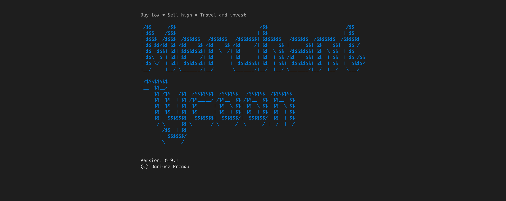
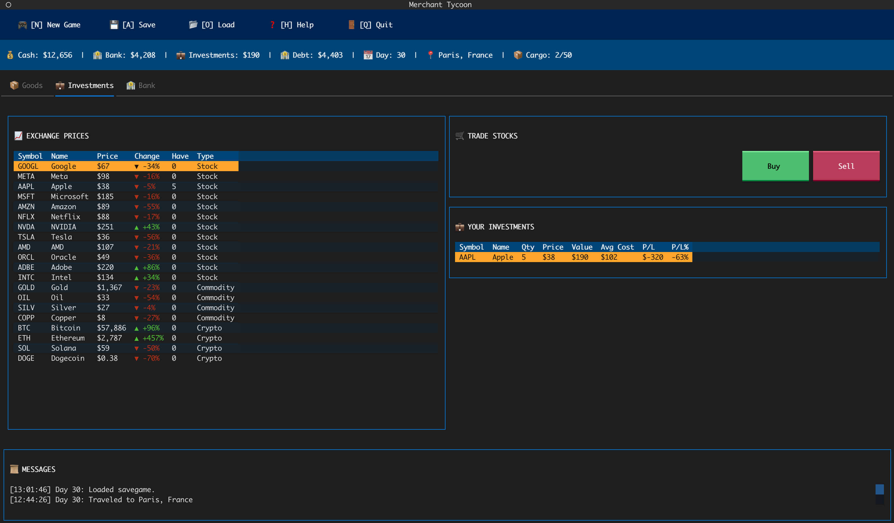
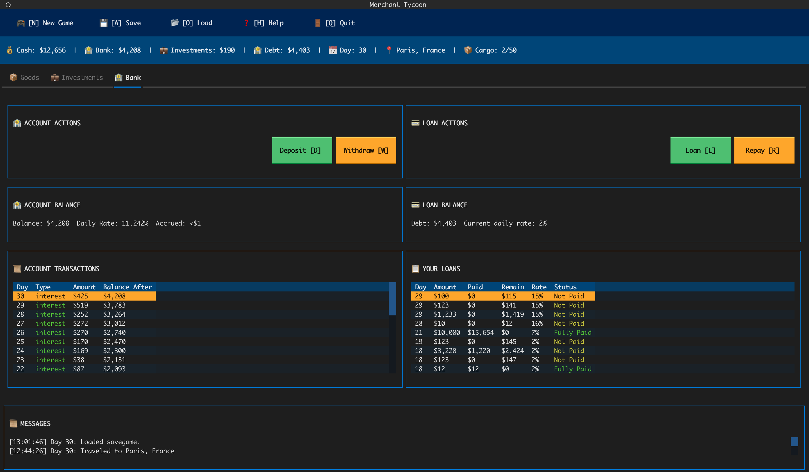

# 🎮 Merchant Tycoon

A terminal-based trading game where you buy low, sell high, travel between cities, and build your fortune through smart trading and investing!


## 📸 Screenshots

### 🚀 Splash Screen

*Startup screen with animated ASCII logo and version info*

### 📦 Goods Trading

*Main trading interface with market prices, inventory management, and real-time price trends*

### 💼 Investments & Stock Market

*Stock market and commodities trading with portfolio tracking and profit/loss analysis*

### 🏦 Bank & Loans

*Banking interface for managing loans and financial operations*

## 📖 About The Game

**Merchant Tycoon** is a terminal-based economic simulation game inspired by classic trading games. Choose your difficulty level and become a wealthy merchant tycoon through strategic trading and smart investments.

### 🎚️ Game Difficulty Levels

Choose your starting challenge when creating a new game (F1):

| Difficulty | Starting Cash | Cargo Slots | Description |
|-----------|---------------|-------------|-------------|
| **Playground** | $1,000,000 | 1000 | Unlimited funds for experimentation |
| **Easy** | $100,000 | 100 | Generous starting resources |
| **Normal** | $50,000 | 50 | Balanced challenge (default) |
| **Hard** | $10,000 | 10 | Limited resources, strategic planning required |
| **Insane** | $0 | 1 | Start with nothing, maximum challenge |

Press **F1** to start a new game and select your difficulty. Each level offers a unique experience from sandbox mode to extreme survival!

The game combines:
- **Difficulty Selection**: Choose from 5 difficulty levels (Playground to Insane)
- **City Trading**: Buy and sell goods across 11 European cities with varying prices
- **Diverse Product Categories**: Trade in electronics, luxury goods, cars, and contraband (31 products total)
- **Stock Market**: Invest in 16 real company stocks (Tech giants like Google, Apple, NVIDIA, Tesla, and gaming companies like CD Projekt Red, Nintendo, Ubisoft, Electronic Arts)
- **Commodities**: Trade in 8 commodities including precious metals (Gold, Silver, Platinum, Copper) and agricultural products (Cocoa, Sugar, Coffee) plus Oil
- **Cryptocurrency**: Invest in 8 cryptocurrencies including major coins (Bitcoin, Ethereum, Solana, Dogecoin) and altcoins (Avalanche, Polkadot, Decentraland, 1inch)
- **Cargo Upgrades**: Extend inventory capacity; each added slot doubles in price (starts at 50)
- **Banking System**: Deposit cash to earn interest (1-3% APR, compounded daily), manage your savings
- **Loan System**: Take multiple loans to grow faster with variable APR (1-20%, compounded daily)
- **Risk Management**: Balance between inventory (vulnerable to events) and investments (safe)

## 🎯 Game Objective

**Main Strategy: TRAVEL → BUY → SELL → INVEST → SAVE**

1. Travel between cities to find the best prices
2. Buy goods when prices are low
3. Sell goods when prices are high in other cities
4. Invest your profits in the stock market for safe, long-term growth
5. Save excess cash in the bank to earn interest
6. Build a diversified portfolio while continuing to trade

## 🚀 How to install and run

### Installation

**Quick install (no clone)**
```bash
pip install git+https://github.com/artdarek/MerchantTycoon.git

# Run the game
python3 -m merchant_tycoon
```

**Option 1: Install with uv (recommended)**
```bash
# Clone the repository
git clone https://github.com/artdarek/MerchantTycoon.git
cd MerchantTycoon

# Install the game and dependencies
uv pip install -e .

# Run the game
merchant-tycoon
```

**Option 2: Run as Python module**
```bash
# Clone the repository
git clone https://github.com/artdarek/MerchantTycoon.git
cd MerchantTycoon

# Install dependencies
uv pip install textual

# Run the game as a module
python -m merchant_tycoon
```

**Option 3: Using Makefile (developer-friendly)**
```bash
# Clone the repository
git clone https://github.com/artdarek/MerchantTycoon.git
cd MerchantTycoon

# See all available commands
make help

# Create virtual environment
make venv

# Activate the virtual environment
source .venv/bin/activate

# Sync dependencies (creates uv.lock and installs exact versions)
make sync

# Or install in development mode (editable)
make install-dev

# Run the game
make run

# Update dependencies to latest versions
make upgrade

# Clean build artifacts and venv
make clean
```

> **Note**: This project uses [uv](https://github.com/astral-sh/uv) - a fast Python package installer written in Rust. If you don't have uv installed, you can install it with: `curl -LsSf https://astral.sh/uv/install.sh | sh`
>
> **Dependency Management Tips**:
> - `make sync` - Install dependencies from uv.lock (reproducible builds)
> - `make upgrade` - Upgrade all packages to latest compatible versions
> - `make install-dev` - Install in editable mode (for development)

### Controls

The game has **4 tabs** (Goods, Investments, Bank, Lotto) with context-sensitive controls:

#### Global Controls (Always Available)
| Key | Action | Description |
|-----|--------|-------------|
| **F1** | New Game | Start a new game (deletes current save) |
| **F2** | Save | Save current game progress |
| **F3** | Load | Load saved game |
| **F4** | Help | Show in-game instructions |
| **F5** | About | Show About modal |
| **Q / ESC** | Quit | Exit the game |
| **F9** | Splash | Show splash screen |
| **N** | Newspaper | View full message history in scrollable newspaper modal |
| **C** | Cargo | Extend cargo capacity by +1 slot (pricing per config) |
| **1/2/3/4** | Tabs | Switch to Goods / Investments / Bank / Lotto |

#### 📦 Goods Tab Controls
| Key | Action | Description |
|-----|--------|-------------|
| **T** | Travel | Move to another city to find better prices |
| **B** | Buy | Purchase goods at current city prices |
| **S** | Sell | Sell goods from your inventory |
| **L** | Loan | Borrow money (up to $10,000 per loan) |
| **R** | Repay | Pay back your loans |

#### 💼 Investments Tab Controls
| Key | Action | Description |
|-----|--------|-------------|
| **B** | Buy | Purchase stocks, commodities, or crypto |
| **S** | Sell | Sell assets from your portfolio |

#### 🏦 Bank Tab Controls
| Key | Action | Description |
|-----|--------|-------------|
| **D** | Deposit | Deposit cash into bank account (earns interest APR 1-3%) |
| **W** | Withdraw | Withdraw cash from bank account |
| **L** | Loan | Take out a new loan (APR 1-20%, max $10,000) |
| **R** | Repay | Repay existing loans |

#### 🎰 Lotto Tab
- Left column panels:
  - Buy Ticket: shows pricing, renewal cost, and rules
  - Actions: compact bar with two buttons
    - Buy ticket: open modal to enter 6 unique numbers
    - Lucky shot!: open the same modal prefilled with 6 random unique numbers
  - Owned Tickets: table of your tickets with columns Day, Status, numbers 1–6, Cost, Reward, P/L
    - Row click opens Ticket Actions (Activate/Deactivate, Remove)
  - Tickets Summary: totals for Owned/Active, Cost, Reward, P/L
- Right column panels:
  - Today’s Draw: shows today’s 6 numbers and per‑day totals (Today’s cost, Today’s payout, P/L)
  - Win History: table of past wins with Day, numbers, Matched, Payout (newest first)

### Game Mechanics

#### 🏙️ Cities & Pricing
- **11 European Cities**: Warsaw, Berlin, Prague, Vienna, Budapest, Paris, London, Rome, Amsterdam, Barcelona, Stockholm
- Each city has different price multipliers for each good
- Prices fluctuate randomly within a range (±30%)
- Look for arbitrage opportunities between cities
- Travel between cities to exploit price differences

**City Risk Levels:**
- **Safe Cities** (low event probability, more gains): Stockholm (15%), Vienna (18%), Paris (20%), London (20%)
- **Medium Risk**: Berlin (22%), Barcelona (22%), Warsaw (25%), Rome (25%)
- **High Risk** (high event probability, more losses): Budapest (28%), Prague (30%), Amsterdam (32%)

#### 📦 Goods & Product Categories

The game features **31 unique products** across 4 main categories:

**🖥️ Electronics** (Standard & Luxury)
- **Standard Electronics**: TV ($800), Computer ($1,200), Printer ($300), Phone ($600), Camera ($400), Laptop ($1,500), Tablet ($500), Console ($450), Headphones ($150), Smartwatch ($400), VR Headset ($700), Coffee Machine ($450), Powerbank ($40), USB Charger ($25), Pendrive ($15)
- **Luxury Electronics**: Gaming Laptop ($3,000), High-end Drone ($2,500), 4K OLED TV ($2,500)
- Price volatility: ±30%

**💎 Jewelry** (Luxury)
- Luxury Watch ($6,000), Diamond Necklace ($8,000)
- Price volatility: ±60-70%
- High profit margins in wealthy cities (Paris, London, Stockholm)

**🚗 Cars** (Standard & Luxury)
- **Standard Cars**: Fiat ($20,000), Opel Astra ($40,000), Ford Focus ($50,000)
- **Luxury Cars**: Ferrari ($100,000), Bentley ($200,000), Bugatti ($300,000)
- Price volatility: ±30-60%
- Best arbitrage opportunities between cities

**⚠️ Contraband** (High Risk, High Reward)
- **Drugs**: Weed ($500), Cocaine ($2,000) - volatility ±80-100%
- **Weapons**: Grenade ($100), Pistol ($500), Shotgun ($1,000) - volatility ±80-90%
- Significant price differences between cities (e.g., Amsterdam vs. Stockholm)
- Higher risk from random events but massive profit potential

**Product Types:**
- **Standard**: Stable prices, lower volatility, consistent profits
- **Luxury**: Higher prices, more volatility, better margins in premium cities
- **Contraband**: Highest volatility, extreme price variations, maximum risk/reward

#### 📦 Inventory Management
- **Capacity**: Starts based on difficulty level (Insane: 1, Normal: 50, Playground: 1000)
- **Cargo Size System**: Each product occupies different number of slots:
  - **Small items** (1 slot): Pendrive, USB Charger, Powerbank, Headphones
  - **Medium items** (2-3 slots): Most electronics (TV, Phone, Camera, etc.)
  - **Large items** (5 slots): Luxury electronics (Gaming Laptop, 4K OLED TV, Drone), Jewelry
  - **Vehicles** (10 slots): All cars (Fiat, Ferrari, Bugatti, etc.)
- **Upgrades**: Press C to extend by +1 slot (pricing mode configurable: linear or exponential)
- **FIFO System**: Goods are sold in First In, First Out order
- **Purchase Lots**: Track each purchase separately to calculate profit/loss accurately
- **Random Events**: Can affect your inventory (theft, damage, confiscation, etc.)
- **Strategy**: Mix standard goods (stable income) with high-risk/high-reward contraband
- **Cargo Planning**: Balance small high-quantity items vs large high-value items

#### 💼 Stock Exchange & Investments
- **Stocks** (16 companies):
  - **Tech Giants**: Google (GOOGL), Meta (META), Apple (AAPL), Microsoft (MSFT), Amazon (AMZN), Netflix (NFLX), NVIDIA (NVDA), Tesla (TSLA), AMD, Oracle (ORCL), Adobe (ADBE), Intel (INTC)
  - **Gaming Companies**: CD Projekt Red (CDR), Nintendo (NTD), Ubisoft (UBI), Electronic Arts (EAA)
- **Commodities** (8 types):
  - **Precious Metals**: Gold (GOLD), Silver (SILV), Platinum (PLT), Copper (COPP)
  - **Energy & Agriculture**: Oil (OIL), Cocoa (COC), Sugar (SGR), Coffee (CFE)
- **Cryptocurrency** (8 coins):
  - **Major Coins**: Bitcoin (BTC), Ethereum (ETH), Solana (SOL), Dogecoin (DOGE)
  - **Altcoins**: Avalanche (AVAX), Polkadot (DOT), Decentraland (MANA), 1inch (1INCH)
- **Dividend System** (Stocks only):
  - Select stocks pay **regular dividends** every 11 days
  - Must hold shares for at least 10 days to qualify for dividends
  - Dividend rate varies by stock (0.1-0.3% of current price per share)
  - Payouts deposited directly to your bank account
  - Detailed breakdown shows dividends per holding
  - **Example**: 100 shares of CDR at $200/share with 0.1% rate = $20 dividend
- **Price Trends**: Watch for ▲ (up), ▼ (down), or ─ (stable) indicators
- **Price Volatility**: Stocks ±50%, Commodities ±30-80%, Crypto ±70-90%
- **Safety**: Investments are protected from random events!
- **Long-term**: Build wealth through diversified portfolio and regular dividend income

#### 💰 Loans & Debt
- Take **multiple loans** to grow your business faster
- Each loan has its own **variable APR** (1-20% annual rate, randomized each travel)
- Loan APR is converted to daily rate (APR ÷ 365) and compounds daily
- Interest rates change with each travel, but **existing loans keep their original APR**
- Maximum $10,000 per loan
- **Example:** 10% APR loan = 0.027% daily interest, but compounds over time
- Fractional interest accrues until it reaches $1, then adds to loan balance
- Use loans strategically when you have clear profit opportunities (>20-25% margin)

#### 🧮 Credit Capacity
- Purpose: caps total debt based on your wealth to prevent unlimited borrowing.
- Wealth = cash × cash_haircut + bank_balance + Σ(portfolio_qty × price × asset_haircut)
- Total debt cap = wealth × leverage_factor + base_allowance
- Max new loan = max(0, debt cap − current total debt)
- Default haircuts (configurable in `BankSettings`):
  - cash: 0.5, stocks: 0.8, commodities: 0.7, crypto: 0.5
- Defaults: `leverage_factor=0.8`, `base_allowance=$1,000`.
- Example: if cash=$5,000, bank=$2,000, portfolio=$10,000 (stocks), wealth≈$5,000×0.5+$2,000+$10,000×0.8=$2,500+$2,000+$8,000=$12,500 → cap≈$12,500×0.8+$1,000=$11,000; if current debt=$3,000 → max new loan ≈ $8,000.

#### 🏦 Banking System
- **Deposit cash** into your bank account to keep it safe
- Earn **interest** on deposits (1-3% APR, randomized each travel)
- Interest is converted to daily rate (APR ÷ 365) and compounds daily
- **Example:** 2% APR = 0.0055% daily interest ≈ $55/day on $1,000,000
- Fractional interest accrues until it reaches $1, then adds to your balance
- **Withdraw** anytime without penalties
- Bank balance is protected from random events
- Lower risk, lower reward compared to goods trading or investments

#### 🎲 Random Events System
Travel between cities triggers random events that can affect your journey. Each city has unique event probability and risk profile.

**Event Categories:**
Events are now categorized into three types based on their impact:

1. **Loss Events** (8 types) - Red modals (⚠️ Bad News!):
   - **Inventory/Cash Loss**: Robbery, Fire, Flood, Defective Batch, Customs Duty, Stolen Goods, Accidents
   - **Portfolio Events**: Portfolio Crash (your held assets of one type crash 30-70%)

2. **Gain Events** (4 types) - Green modals (✨ Good News!):
   - **Direct Gains**: Dividend, Lottery, Bank Correction
   - **Portfolio Events**: Portfolio Boom (your held assets of one type surge 150-300%)

3. **Neutral Events** (6 types) - Gray modals (ℹ️ Market Update):
   - **Goods Price Events**: Promotion, Oversupply, Shortage, Loyal Discount
   - **Market Events**: Market Boom (all assets of random type surge 150-300%), Market Crash (all assets of random type drop 30-70%)

**Multiple Events Per Journey:**
- Cities can trigger 0-3 loss events, 0-3 gain events, and 0-2 neutral events per journey
- Events are displayed sequentially in blocking modals (press Enter to continue)
- No duplicate events in a single journey
- Event selection is weighted based on your current game state

**City-Specific Event Configuration:**
Each city has unique event probability and risk/reward balance:
- **Safe Cities** (Stockholm, Vienna): 15-18% event chance, 0-1 loss events, 1-3 gain events, 1-2 neutral events
- **Balanced Cities** (Warsaw, Rome, Berlin): 22-25% event chance, 0-2 loss/gain events, 0-1 neutral events
- **Risky Cities** (Prague, Amsterdam): 30-32% event chance, 1-3 loss events, 1-3 gain events, 1-2 neutral events

**Investment Market Events (NEW!):**
- **Market Boom/Crash**: Affects ALL assets of a random type (stocks, commodities, or crypto)
  - Example: "📈 MARKET BOOM! STOCK market surges +180%! GOOGL: $150 → $420, META: $80 → $224, ..."
- **Portfolio Boom/Crash**: Affects only YOUR held assets of a random type
  - Example: "💰 PORTFOLIO BOOM! Your stocks surge +220%! Paper gain: $45,000. NVDA: $250 → $800, ..."
- These events create dramatic market movements and trading opportunities

**Price Events with Details:**
When events affect prices (Promotion, Oversupply, Shortage, Loyal Discount), you'll see exact price changes:
- **Example:** "🏷️ PROMOTION! TV price drops from $1,200 to $600 (−50%)"
- Plan your purchases around these temporary price modifiers

**Protection Strategy:**
- Bank deposits are **protected from loss events**
- Only inventory and cash are vulnerable to loss events
- Investments can fluctuate with Market Boom/Crash events (neutral impact on all players)
- Your portfolio specifically can be affected by Portfolio Boom/Crash events
- Strategy: Diversify across multiple asset types to reduce Portfolio Crash risk

## 📊 Game Interface

The game uses a **tabbed interface** with three main tabs:

### 📦 Goods Tab
- **Market Prices**: Current prices for all goods in your city with trend indicators
- **Trade Actions**: Buy and Sell buttons
- **Your Inventory**: List of goods you own with quantities, costs, and profit/loss
- Travel between cities to find the best prices

### 💼 Investments Tab
- **Exchange Prices**: Live prices for stocks, commodities, and cryptocurrencies
- **Trade Actions**: Buy and Sell buttons
- **Your Portfolio**: List of assets you own with purchase history and profit/loss

### 🏦 Bank Tab
- **Bank Account**: Your deposit balance and daily interest rate
- **Your Loans**: List of active loans with details (principal, remaining, rate, day taken)
- **Actions**: Deposit, Withdraw, Take Loan, Repay Loan

### Common Elements (All Tabs)
- **Stats Panel** (Top): Cash, Bank Balance, Investments Total, Debt, Day, Location, Cargo
- **Message Log** (Bottom): Game events, transactions, and system messages
- **Global Actions Bar** (Very Top): New Game, Save, Load, Help, Quit

## 💡 Tips & Strategy

### For Beginners
1. Start by learning which cities have good prices for specific goods
2. Travel to a city, buy what's cheap, travel to another, sell what's expensive
3. Keep some cash reserve for opportunities
4. Once you have steady profit, start investing in stocks
5. Use the bank to protect excess cash and earn interest

### Advanced Strategy
1. **Diversify**: Spread wealth across goods, stocks, commodities, crypto, and bank deposits
2. **Arbitrage**: Find goods with big price differences between cities (check all 11 cities!)
3. **Trend Following**: Buy stocks showing ▲ uptrend, avoid ▼ downtrend
4. **Dividend Strategy**:
   - Hold dividend-paying stocks for passive income (paid every 11 days)
   - Buy stocks early in the game cycle to maximize dividend payouts
   - Dividend income grows with stock prices (paid as % of current price)
   - Long-term stock holdings generate regular cash flow to your bank
5. **Risk Balance**:
   - 40% in safe investments (stocks/commodities)
   - 30% in bank (earning interest, protected)
   - 20% in active trading (goods)
   - 10% in high-risk crypto
6. **Debt Leverage**:
   - Take multiple small loans instead of one big loan
   - Compare loan APR before borrowing (changes with each travel)
   - Only borrow when you have clear profit opportunity (>20-25% margin)
   - Remember: Even 1% APR = 0.0027% daily, which compounds over time
7. **Event Protection**: Move wealth to stocks/commodities/bank before risky situations
8. **Banking Strategy**:
   - Bank interest (1-3% APR) is modest but safe
   - Best for parking large amounts of cash you don't need immediately
   - **Not** a primary wealth-building strategy (too low APR)
   - Use for safety, not growth
9. **Crypto Timing**: High volatility = high risk and high reward, time your trades carefully
10. **City Risk Strategy**:
   - **Safe Routes** (Stockholm, Vienna, Paris, London): Lower event chance, more gain events - ideal for protecting large inventory
   - **Risky Routes** (Prague, Amsterdam): Higher event chance, more loss events - best for contraband arbitrage with small, quick trips
   - **Balanced Routes** (Warsaw, Rome, Berlin): Standard risk/reward - good for consistent trading
11. **Cargo Optimization**:
    - **Small items** (1 slot): Maximize quantity, lower unit value (Pendrive, Powerbank)
    - **Medium items** (2-3 slots): Balance quantity and value (most electronics)
    - **Large items** (5 slots): Premium goods, high value per unit (Gaming Laptop, Jewelry)
    - **Vehicles** (10 slots): Highest value, lowest quantity - best for large capital trades
    - **Strategy**: Mix cargo sizes based on available capital and risk tolerance
12. **Event Exploitation**:
    - When you get Promotion/Oversupply/Shortage events, buy the affected goods immediately
    - Loyal Discount (95% off) is the jackpot - max out your cargo on that good
    - Price modifiers are temporary (one day) - exploit them before traveling again

## 🛠️ Technical Details

### Built With
- **Python 3.14**
- **Textual Framework**: Modern TUI (Text User Interface) framework

### Features
- **5 Difficulty Levels**: From Playground ($1M, 1000 slots) to Insane ($0, 1 slot)
- **31 Tradable Products**: Electronics, luxury goods, cars, and contraband
- **4 Product Categories**: Standard, luxury, cars, and high-risk contraband
- **Cargo Size System**: Products occupy 1-10 slots based on size (Pendrive: 1 slot, Ferrari: 10 slots)
- **Tabbed Interface**: 3 main tabs (Goods, Investments, Bank) with context-sensitive controls
- **Real-time price updates**: All prices fluctuate dynamically
- **FIFO Accounting**: First In, First Out inventory and investment tracking
- **Profit/Loss Tracking**: Detailed transaction history with real-time P/L calculations
- **Advanced Random Event System**:
  - **Three event categories**: Loss (red modals), Gain (green modals), Neutral (gray modals)
  - Multiple events per journey (0-3 loss, 0-3 gain, 0-2 neutral events)
  - City-specific event probabilities (15-32%)
  - Sequential modal display with detailed information
  - **Investment Market Events**: Market Boom/Crash (affects all assets of one type), Portfolio Boom/Crash (affects player's holdings)
  - Price events show exact before/after prices
- **Price Trend Indicators**: Visual ▲▼─ indicators for all assets
- **Multi-Loan System**: Take multiple loans with individual APR (1-20%), daily compounding
- **Banking System**: Deposit/withdraw with interest accrual (1-3% APR, daily compounding)
- **Realistic Interest Model**: APR converted to daily rates (APR÷365), fractional cents tracked
- **Cryptocurrency Trading**: High-risk, high-reward crypto investments (8 coins including BTC, ETH, SOL, DOGE, AVAX, DOT, MANA, 1INCH)
- **Stock Market**: 16 real company stocks with realistic volatility (12 tech giants + 4 gaming companies)
- **Dividend System**: Regular dividend payouts every 11 days for dividend-paying stocks (must hold for 10+ days)
- **Commodities**: 8 types including precious metals and agricultural products (Gold, Silver, Platinum, Copper, Oil, Cocoa, Sugar, Coffee)
- **11 European Cities**: Each with unique price multipliers and risk profiles
- **Auto-save/Load**: Persistent game state across sessions
- **Responsive Terminal UI**: Colorful, styled interface using Textual framework

### Domain Architecture

The game follows a clean, modular architecture with separated concerns:

**Domain Layer** (`src/merchant_tycoon/domain/`)
- **`goods.py`**: 31 tradable products (GOODS constant)
- **`cities.py`**: 11 European cities with price multipliers (CITIES constant)
- **`assets.py`**: 32 financial assets - 16 stocks, 8 commodities, 8 crypto (ASSETS constant)
- **`game_difficulty_levels.py`**: 5 difficulty presets (GAME_DIFFICULTY_LEVELS constant)
- **`model/`**: Domain models (Good, City, Asset, GameDifficultyLevel, etc.)

**Engine Layer** (`src/merchant_tycoon/engine/`)
- **GameEngine**: Main game orchestration
- **GameState**: Game state management
- **Services**: Business logic (GoodsService, InvestmentsService, BankService, TravelService, etc.)

**UI Layer** (`src/merchant_tycoon/ui/`)
- **Textual-based TUI**: Modular panels and screens
- **Context-sensitive controls**: Different keybindings per tab

**Configuration** (`src/merchant_tycoon/config.py`)
- Centralized settings using Pydantic BaseSettings
- All game parameters configurable (pricing, fees, rates, events, etc.)

## 🛠️ Development & Building

### Development Setup

To contribute or develop the game, install with dev dependencies:

```bash
# Clone the repository
git clone https://github.com/artdarek/MerchantTycoon.git
cd MerchantTycoon

# Create virtual environment
make venv
source .venv/bin/activate

# Install with dev dependencies (includes PyInstaller for building)
uv pip install -e .[dev]

# Run the game
make run
```

### Building macOS Application

Build a standalone macOS .app bundle:

```bash
# Build both executable and .app bundle
make build-macos

# Clean build artifacts
make build-clean
```

This creates:
- `dist/Merchant Tycoon` - Terminal executable (~13.5 MB)
- `dist/Merchant Tycoon.app` - Double-clickable macOS app

For detailed build instructions, see [BUILD.md](docs/BUILD.md).

### Available Make Commands

```bash
make help          # Show all available commands
make venv          # Create/manage virtual environment
make sync          # Install dependencies from uv.lock
make install-dev   # Install in development mode
make run           # Run the game
make clean         # Clean all build artifacts
make build-macos   # Build macOS application
make build-clean   # Clean build artifacts only
```

## 🤖 Created Entirely with AI Agents on board

This game was **100% created using AI Agents** (well 99% to be honest - I just could not resist).
Almost every line of code, every feature, and every design decision was made through conversation with AI
(Claude Code, Codex and Junie). 

### No Manual Coding

- Almost **Zero lines** written by hand in a traditional code editor
- All logic, UI, styling, and documentation generated through AI conversation
- Demonstrates the power of conversational programming
- Shows how complex applications can be built through natural language

### Development Process

The entire development was done through natural language conversations. The development process included:

1. **Initial Concept**: "Let's create a terminal trading game"
2. **Iterative Development**: Feature by feature through conversation
3. **Planning mechanics**: "Let's plan how to implement better loan mechanics"
4. **Feature Additions**:
   - Started with basic buy/sell mechanics
   - Added city travel system
   - Built banking system with deposits and interest- 
   - Implemented multi-loan system with variable rates
   - Created stock exchange with 12 real company stocks
   - Integrated cryptocurrency trading (Bitcoin, Ethereum, Solana, Dogecoin)
   - Implemented tabbed interface (Goods, Investments, Bank)
   - Added context-sensitive keyboard controls
5. **UI Refinements**: Adjusting layouts, adding panels, fixing alignment 
6. **Iterative Refactoring**:  
   - Polishing project architecture 
   - From single file project to well-organized layers
   - Implementing design patterns and good practices
   - Cleaning up code 
   - Adding/Updating documentation and comments

### What This Demonstrates

This project showcases:
- **Natural Language Programming**: Building software by describing what you want
- **Iterative Development**: Refining features through conversation
- **AI-Human Collaboration**: Combining human creativity, experience and knowledge with AI implementation
- **Rapid Prototyping**: From concept to working game in a single session

## 📝 License

MIT License - feel free to use, modify, and distribute.

## 🙏 Acknowledgments

- Built with [Textual](https://github.com/Textualize/textual) by Textualize
- Inspired by classic trading games like Dope Wars and Drug Wars
- Proof of concept created using [Claude](https://www.anthropic.com/claude) by Anthropic
- Special thanks to [JuniePro](https://www.jetbrains.com/junie/) for stepping in to support development whenever Claude's rate limit hit
- [OpenAI Codex](https://openai.com/research/codex) stepped in when Junie left the team (she wanted more money that we couldn't afford), 

## 🎮 Start Playing!

```bash
python3 merchant_tycoon.py
```

Good luck, and may your trades be profitable! 🚀💰

---

*"In code we trust, in Claude we build."* - A demonstration of AI-powered software development

## 🛠️ Other Tools Used

- ASCII logo generator: https://patorjk.com/software/taag/#p=display&f=Big+Money-ne&t=Merchant%0ATycoon%0AT-ai-coon%0A&x=none&v=4&h=4&w=80&we=false
  - Font: Big Money-ne
  - Used to create the splash screen ASCII art variants (Merchant Tycoon / T-ai-coon)
- ASCI IMAGES generator: https://www.asciiart.eu/image-to-ascii